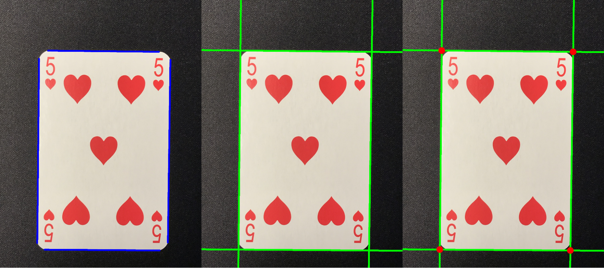
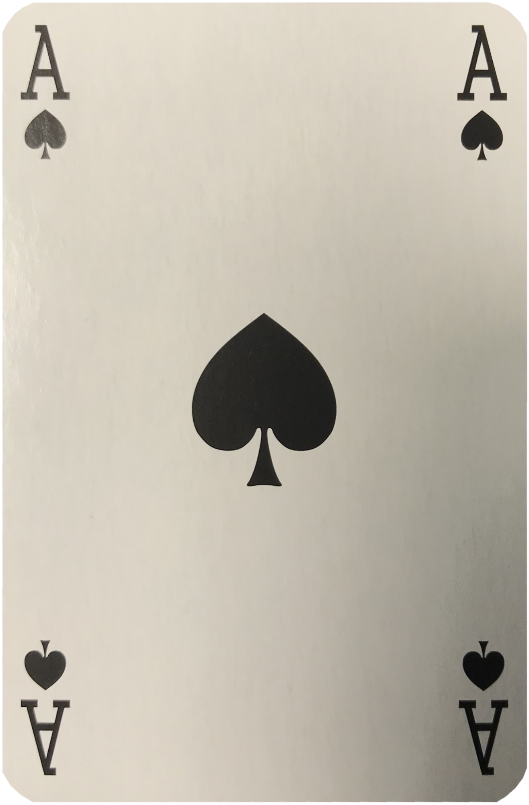
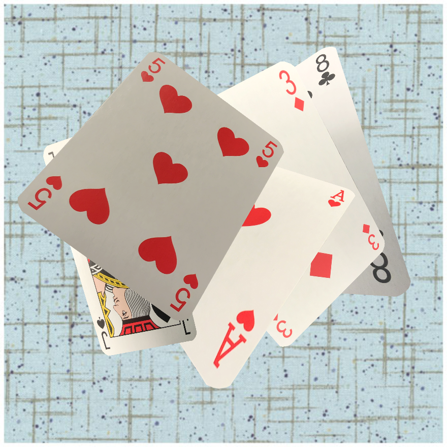
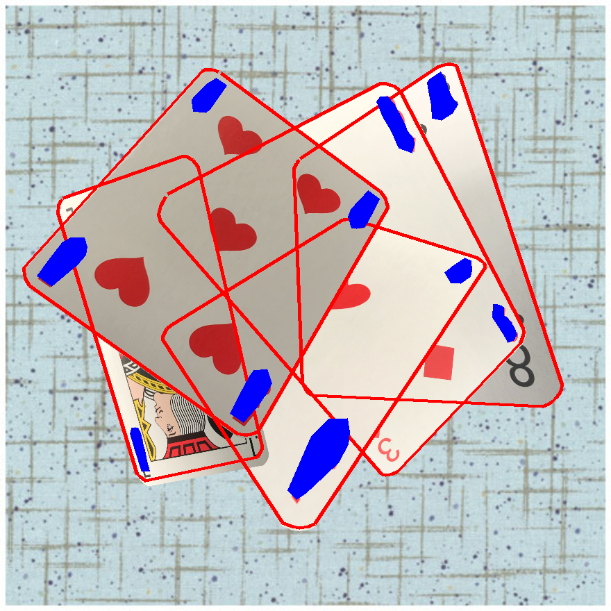
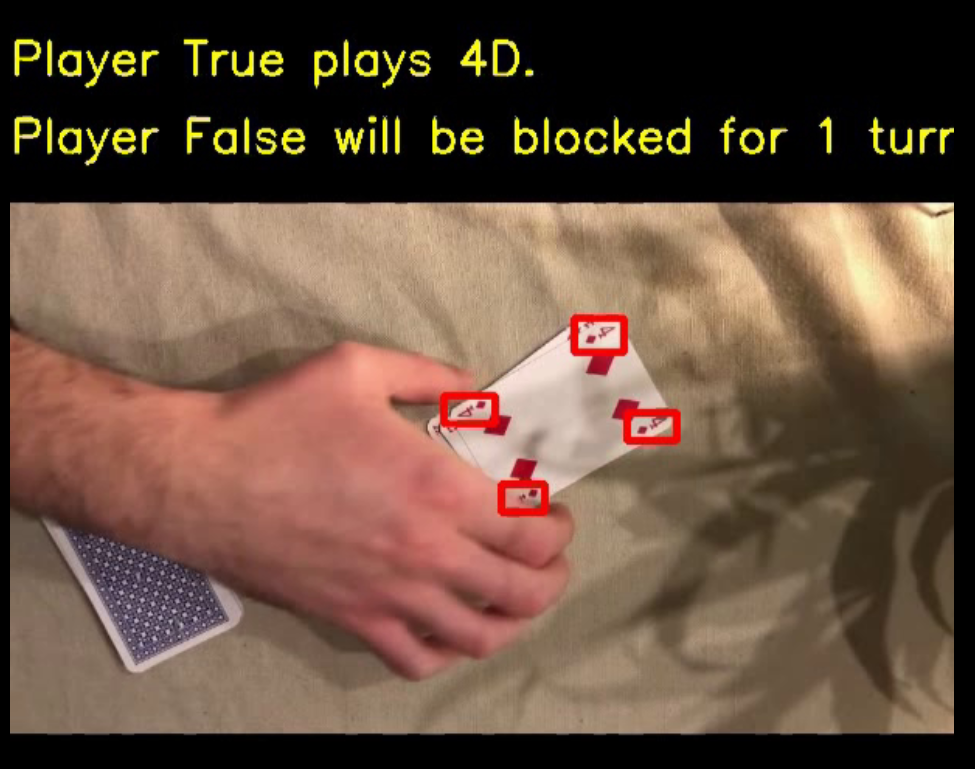
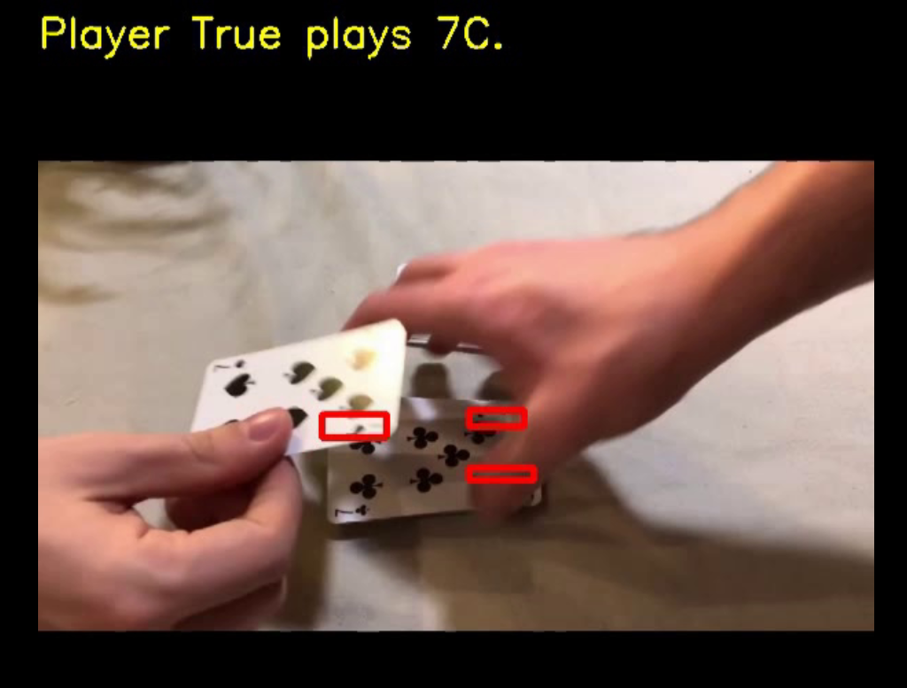
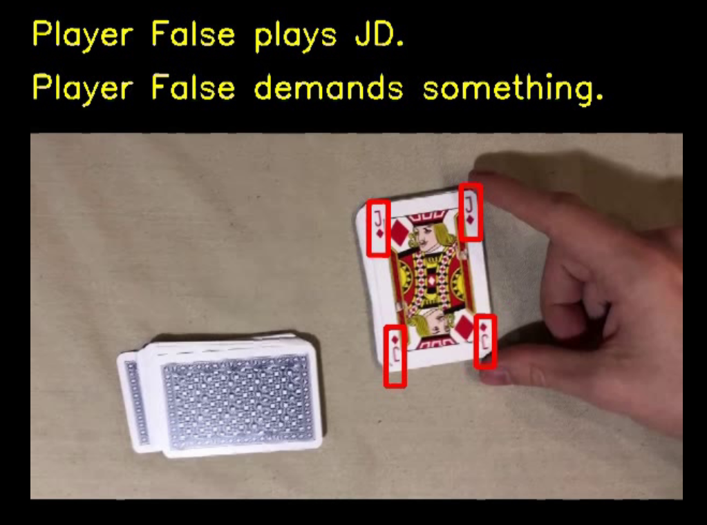

## Card detection on Game of Macau

### Card extraction

To extract a card its position was identified.
Firstly, we found straight lines in the picture. 
Secondly, we  extended those lines to the borders of the image to ensure crossings between lines.
Lastly we identified crossing points.

    
    

        
 Having found the position of the card we performed a perspective transform to ensure that the card is straight. 
            Furthermore, we cropped each card by its downsized version of mask to obtain a card without any artifacts on the border.
        

    

### Generating artificial data

    

        
 
    To keep our generated data diverse we wrote a number of transformations classes, including classes responsible for:
     <ul>
      <li>random  brightness/
contrast change,</li>
      <li>perspective transform,</li>
      <li>resize.</li>
    </ul>   
    

    
    
    

        

        
 
        Having imposed cards in the background we make sure that at least one corner of every card is visible, we checked if the polygons from the newly added card would intersect with the polygons of the corners of cards that are already superimposed on the background.
    

    
    

### YOLO

After generating 20000 images and training for 30 epoches we were able to obtain satisfactory results oscillating at 0.9
mAP@.5:0.9. After many failures, we found out that we should first train our model on straight images and then fine-tune
it on the images with applied perspective transform. For training we scaled images to squares of side 608. For inference
we scaled videos to 608 for a bigger side and padded smaller side.

### Results

Given the detected classes with corresponding bounding boxes for every frame, we annotated the initial videos with text
messages containing information about the current state of the game (and if any events were detected). We’ve also
annotated the corners of the cards with the bounding boxes received from our model. Currently, we assume that the game
is played between only two players (denoted by False and True respectively), but we were able to count for how many
turns any player should be blocked, or how many cards should be drawn due to lost war.

        
        
        

project created by: Mikołaj Kruś & Maciej Filanowicz

